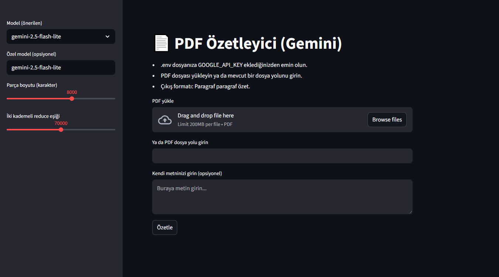

# PDF Özetleyici (Gemini)

Bu proje, PDF dosyalarını Google Generative AI modelleri kullanarak özetlemek için geliştirilmiş bir Streamlit uygulamasıdır.

## Özellikler
- PDF dosyalarını yükleyerek veya dosya yolunu girerek özetleme.
- Kullanıcı tarafından girilen metinleri özetleme.
- Özetlerin indirilmesi için bir indirme tuşu.
- Desteklenen modeller: `gemini-2.5-flash-lite`, `gemini-1.5-flash-lite`, `gemini-1.5-flash`, `gemini-1.5-pro`.

## Kurulum

1. Bu projeyi klonlayın:
   ```bash
   git clone <repository-url>
   ```

2. Gerekli Python paketlerini yükleyin:
   ```bash
   pip install -r requirements.txt
   ```

3. `.env` dosyasına Google API anahtarınızı ekleyin:
   ```env
   GOOGLE_API_KEY=your_api_key_here
   ```

## Kullanım

1. Uygulamayı başlatın:
   ```bash
   streamlit run app.py
   ```

2. Tarayıcıda açılan arayüzde PDF dosyanızı yükleyin veya dosya yolunu girin.
3. Özetleme işlemini başlatmak için "Özetle" tuşuna basın.
4. Özetlenen metni sağ tarafta görüntüleyebilir ve indirebilirsiniz.

## Arayüz

Aşağıda uygulamanın arayüzü gösterilmektedir:



## Katkıda Bulunma

Katkıda bulunmak için lütfen bir `pull request` gönderin veya bir `issue` açın.

## Lisans

Bu proje MIT Lisansı altında lisanslanmıştır.
